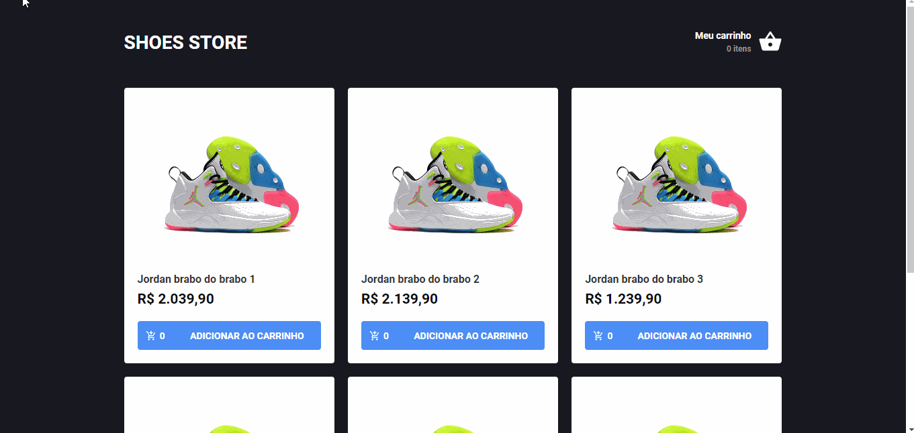

# Shoes Store Redux

Mini Aplicação em React simulando o uso de redux e redux-saga
para manipualação de estados globais em um ecommerce



## Neste projeto foram utilizadas as seguintes ferramentas:

* [React](https://pt-br.reactjs.org/)
* [Redux](https://redux.js.org/)
* [Redux Saga](https://redux-saga.js.org/)
* [react-redux](https://react-redux.js.org/)
* [Reactotron](https://github.com/infinitered/reactotron)
  >- Ferramenta usada para facilitar o debug dos nossos estados globais
* [reactotron-redux](https://github.com/infinitered/reactotron/blob/master/docs/plugin-redux.md)

* [Styled-Components](https://styled-components.com/)
* [react-toastify](https://github.com/fkhadra/react-toastify)
  >- Biblioteca que facilita a criação de mensagens de erro
* [Polished](https://polished.js.org/)
  >- Biblioteca de estilos para javascript
* [React icons](https://react-icons.github.io/react-icons/)
  >- Fonte de todos os ícones da aplicação
* [Axios](https://github.com/axios/axios)
* [history](https://www.npmjs.com/package/history)
* [Immer](https://immerjs.github.io/immer/docs/introduction)
  >- O immer é usado para a alteração de estados que são imutaveis
* [react-router-dom](https://www.npmjs.com/package/react-router-dom)

.

.


### Para executar a aplicação em sua própria máquina, clone este repositório ou faça o download, extraia os arquivos e execute os seguintes passos: 

- [ ] Abra o seu terminal na raiz do diretório

- [ ] Execute o comando ```npm install``` ou ```yarn``` para fazer o download das dependências

- [ ] Execute o comando ```json-server server.json -p 3333``` para rodar nossa FakeAPI. Para evitar problemas, caso não tenha o json-server instalado globalmente em sua máquina, execute o comando  ```npm i -g json-server```

- [ ] Com a nossa API rodando em um terminal, abra um novo terminal e execute o comando ```npm start``` ou ```yarn start``` e o projeto será aberto em seu navegador.

